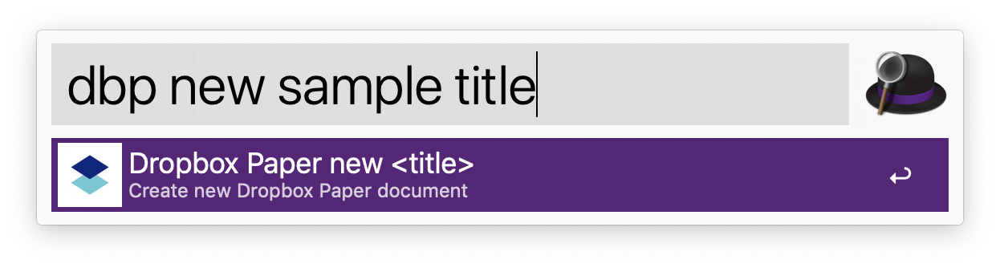

# Alfred Dropbox Paper Workflow

List and open or copy your Dropbox Paper documents.

## Requirement

- Alfred 3 or 4.
- Python 3.x
- Dropbox access Token
  - https://www.dropbox.com/developers/apps/create

## Install

Download and double-click.

- https://github.com/lorentzca/alfred-dropboxpaper-workflow/releases/latest

## Usage

### config

Register Dropbox access token. The access token saved in your "Keychain Access.app".

### open

Open your Dropbox Paper documents.

### copy

Copy a selected document to the clipboard in Markdown format.

### new

Open Dropbox Paper top page.

